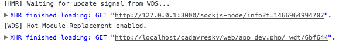
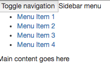
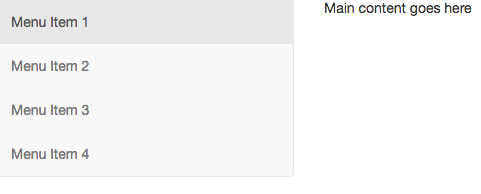

# Tutoriel Symfony / React / Webpack / Babel {#tutoriel-symfony-react-webpack-babel}

Dans ce tutoriel, nous allons voir comment mettre en place un éco-système moderne et performant. Nous allons partir du postulat que vous êtes développeur et donc pas complètement débutant sur :

*   Symfony, son intérêt et son fonctionnement, sans forcément être expert,
*   React (le M de MVC comme clame Facebook, son promoteur) et l'ES6,
*   la ligne de commande et les paquets NPM.

Le but de cet article est plus de montrer comment avoir une stack complète et faire travailler ensemble ces outils plutôt que d'enseigner un langage ou un framework. 

Si vous avez le choix, autant partir sur un environnement full JS avec Node en back et une solution front (React, Angular2, ...), et faites-vous plaisir sur la base de données (MongoDB, Neo4J). Meteor permet d&#039;ailleurs de combiner les deux, ce sera le sujet d&#039;un autre article. 

Mais si on (votre client, votre entreprise ou votre budget) vous impose un hébergement mutualisé, avec PHP et MySQL comme souvent, le mieux reste de partir avec un bon vieux framework comme Symfony 2 et l'ORM Doctrine. Côté front, on pourrait aussi se contenter de la solution classique de templating Twig. Mais pourquoi se priver de pages encore plus performantes, réactives et éviter des rechargements de page si, en plus, on a un code modulaire comme le permet React ?

**Les outils**

Les frameworks JS modernes poussent à du code modulaire, et Webpack se marie bien à React. C'est un "bundler" ou un empaqueteur en bon français, ce qui va permettre de prendre tous les modules et leurs dépendances et d'en faire un fichier de ressource statique, un gros fichier js en somme.

Comme on est parti pour une appli web moderne, autant coder en ES6. Il faut donc utiliser un transpileur tel que Babel. 

Pour démarrer facilement ce projet, nous allons télécharger Symfony et quelques paquets NPM. Bien entendu, Node et NPM doivent être installés sur votre machine de développement.

**Installation**

On commence par télécharger [l'installateur Symfony tel qu'expliqué ici](http://symfony.com/doc/current/book/installation.html) : 

```
--- Linux/Mac ---
sudo curl -LsS https://symfony.com/installer -o /usr/local/bin/symfony
sudo chmod a+x /usr/local/bin/symfony
```

```
--- Windows ---
c:\> php -r "readfile('https://symfony.com/installer');" > symfony
c:\> move symfony c:\projects
c:\projects\> php symfony
```

Puis on installe l'application Symfony. 

```
--- Linux/Mac --- 
symfony new nouveau_projet lts
```

```
--- Windows --- 
c:\> cd projects/
c:\projects\> php symfony new nouveau_projet
```


Avec cette commande, ce sera la version LTS (long term support) actuelle qui sera installée, ce qui garantit d'avoir un support durable. Mais on peut tout aussi bien choisir une version spécifique. Par exemple :

```
symfony new nouveau_projet 3.0.2
```

Pour ceux qui avaient l'habitude d'installer Symfony avec Composer, vous pouvez constater la rapidité accrue de téléchargement et d'installation.

On peut maintenant passer à l'étape suivante : l'installation des outils du front. J'ai nommé React, Babel et Webpack.

Dans le répertoire du projet, on initialise le fichier de configuration NPM qui servira à télécharger les packages nécessaires au projet :
```
npm init -f
```
Cela crée un fichier package.json quasiment vide. J'ai ajouté l'option "-f" pour ne pas avoir à répondre aux questions posées par NPM à l'initialisation. 

On ajoute les packages du projet. Deux bonnes grosses lignes de commande pour ça : 

```
npm i react react-dom --save
npm i react-bootstrap react-hot-loader babel-core babel-loader babel-preset-es2015 babel-preset-react bootstrap-sass css-loader extract-text-webpack-plugin file-loader node-sass sass-loader style-loader webpack webpack-dev-server --save-dev
```
Qu'est-ce que c'est que tous ces paquets ? De base, on aurait pu se contenter des packets babel et webpack mais les paquets concernant Sass et les loaders sont là pour intégrer Twitter Bootstrap que j&#039;ai ajouté dans le projet.

En tout cas, ces commandes vont compléter le fichier package.json déjà créé. On va aussi ajouter un élément pour les scripts : 


L'élément script est vide. Ajoutez le code tel que sur la capture d'écran ci-dessus : 
```
"scripts": {
 "start": "node webpack.dev-server.js",
 "build": "webpack"
 },
```
Puis, il faut un fichier de configuration webpack.config.js à la racine du projet avec ce contenu : 
```
var path = require('path');
var webpack = require('webpack');
var node_modules_dir = path.join(__dirname, 'node_modules');
var ExtractTextPlugin = require('extract-text-webpack-plugin');

var config = { 
   entry: [ 
       'webpack-dev-server/client?http://127.0.0.1:3000', 
       'webpack/hot/only-dev-server',
       './app/Resources/js/app.js', 
       './app/Resources/scss/style.scss' 
    ], 
    output: { 
        path: path.join(__dirname, 'web/dist'),
        filename: 'bundle.js', 
        publicPath: 'http://127.0.0.1:3000/static/'
    }, 
    plugins: [ 
        new webpack.HotModuleReplacementPlugin(), 
        new webpack.NoErrorsPlugin(), 
        new ExtractTextPlugin('style.css', { allChunks: true }),
    ],
    module: { 
        loaders: [ 
           { 
               test: /\.jsx?$/, 
               include: path.join(__dirname, 'app/Resources/js'), 
               exclude: node_modules_dir, 
               loaders: ['react-hot', 'babel?presets[]=es2015&presets[]=react'], 
               presets: ['es2015', 'react'] 
           },
           { 
               test: /\.scss$/, 
               loader: ExtractTextPlugin.extract('css!sass') 
           }, 
           { 
               test: /\.jpe?g$|\.gif$|\.png$|\.svg$|\.woff$|\.woff2?$|\.ttf$|\.eot$|\.svg$/, 
               loader: "file?name=[name].[ext]" 
           } 
        ] 
    }
};
module.exports = config;
```
Et enfin, un fichier webpack.dev-server.js : var webpack = require(&#039;webpack&#039;);var WebpackDevServer = require(&#039;webpack-dev-server&#039;);var config = require(&#039;./webpack.config&#039;);new WebpackDevServer(    webpack(config),    {        publicPath: config.output.publicPath,        hot: true,        quiet: false,        noInfo: false,        historyApiFallback: true    }).listen(    3000,    &#039;0.0.0.0&#039;,    function (err, result) {        if (err) {            console.log(err);        }        console.log(&#039;Listening at 0.0.0.0:3000&#039;);    });Tout est prêt pour commencer à coder : un serveur Node webpack.dev-server (basé sur Express en fait) écoute les modifications sur le code, construit et sert le fichier bundle.js selon la configuration définie dans le fichier webpack.config.js.Il reste donc à démarrer la tâche (dans un deuxième terminal si &quot;brunch watch&quot; est lancé) qui sera utilisée pour le développement(nous verrons plus tard pour la production): npm run startVous devez obtenir le message suivant dans votre terminal : webpack: bundle is now VALID.Si c&#039;est bien le cas, on va créer l&#039;application React. Elle sera incorporée à l&#039;application Symfony. On va donc commencer par mettre en place les conditions pour que React puisse s&#039;épanouir dans l&#039;environnement qui l&#039;accueillera.******L&#039;application côté back**Par défaut, dans le dossier app/Resources/views, nous trouvons le fichier base.html.twig. Etant donné que ce fichier sera celui utilisé par tous les autres templates, nous devons le personnaliser comme ceci : &lt;!DOCTYPE html&gt;&lt;html&gt;  &lt;head&gt;       &lt;meta charset=&quot;UTF-8&quot; /&gt;       &lt;title&gt;Welcome!&lt;/title&gt;       &lt;link rel=&quot;stylesheet&quot; href=&quot;{{ asset(&#039;css/style.css&#039;) }}&quot; /&gt;              &lt;link rel=&quot;icon&quot; type=&quot;image/x-icon&quot; href=&quot;{{ asset(&#039;favicon.ico&#039;) }}&quot; /&gt;  &lt;/head&gt;  &lt;body&gt;              &lt;script src=&quot;{{ asset(&#039;js/vendor.js&#039;) }}&quot;&gt;&lt;/script&gt;                              &lt;script src=&quot;http://127.0.0.1:3000/static/bundle.js&quot;&gt;&lt;/script&gt;                        &lt;script src=&quot;{{ asset(&#039;dist/bundle.js&#039;) }}&quot;&gt;&lt;/script&gt;                   &lt;/body&gt;&lt;/html&gt;Ce qui est intéressant ici, c&#039;est le block . Comme nous sommes en environnement de développement, on insert le fichier généré par Webpack (bundle.js). On remarque que le body est vide, ce qui nous fera une belle page blanche. Notez aussi l&#039;appel à un fichier css (style.css) et un fichier js (vendor.js). Ces fichier seront créés plus tard.En ce qui concerne vendor.js, il contient le code js nécessaire au bon fonctionnement de Bootstrap. Si Bootstrap n&#039;est pas désiré dans votre projet, et que vous abhorrez jquery, vous pouvez supprimer la ligne. Si, en revanche, vous incluez Bootstrap comme nous allons le faire dans ce tutoriel, veillez à ce que la version de jquery définie dans bower.json soit inférieure à 3 (j&#039;ai la 2.2.4) tant que ce n&#039;est pas Bootstrap 4 (3.3.6 à ce jour).Le contrôleur par défaut affiche la page index.html.twig (qui elle-même étend base.html.twig, que nous venons de modifier).Personnalisons ce contrôleur dans src/AppBundle/Controller/DefautController.php :/**  * @Route(&quot;/&quot;, name=&quot;app&quot;)  */  public function indexAction()  {      return $this-&gt;render(&#039;default/index.html.twig&#039;);  }Puis ce fameux fichier index dans app/Resources/views/default/index.html.twig :  &lt;div id=&quot;app&quot;&gt;&lt;/div&gt;Voilà pour la partie twig. C&#039;est React qui va prendre la suite en gérant le html et l&#039;état des objets de l&#039;application front.En résumé de cette partie, nous avons créé les conditions pour que React s&#039;exécute au sein de notre application Symfony en créant une simple balise div avec un id qui vaut &quot;app&quot;. Passons au plus intéressant : l&#039;application React en elle-même.******L&#039;application côté front**React fonctionne par composant. C&#039;est-à-dire que des fichiers js vont inclure d&#039;autres fichiers js et leur passer des objets. Le composant de base s&#039;appellera &quot;app&quot;. Et sera rattaché au DOM par la balise &quot;app&quot; définie dans index.html.twig.Créons donc ce premier composant dans app/Resources/js/app/js : import React from &#039;react&#039;;import ReactDom from &#039;react-dom&#039;;import Component from &#039;./component.js&#039;;ReactDom.render(&lt;Component/&gt;, document.getElementById(&#039;app&#039;));Félicitations, votre application React est créée. Qu&#039;a-t-on fait ? On a dit d&#039;importer react, c&#039;est le minimum. Puis react-dom, qui permettra de manipuler le DOM pour afficher nos composants. Enfin, on importe un composant nommé Component. Ce composant s&#039;affichera dans la balise &quot;app&quot; du fichier HTML grâce à la fonction render de react-dom.Bon si on regarde maintenant dans un navigateur l&#039;adresse http://localhost/nom_du_projet/web/app_dev.php, on ne verra qu&#039;une page blanche.Mais en ouvrant la console du navigateur, vous devriez voir des informations de ce style :Ceci montre que l&#039;application React a démarré, même si elle n&#039;affiche rien pour l&#039;instant. Il y a d&#039;ailleurs aussi une ligne en rouge dans cette console, à propos du composant Component. C&#039;est normal, il n&#039;est pas encore créé.Pour commencer à afficher quelque chose, il faut créer le fichier component.js (toujours dans app/Resources/js/app/) avec ce contenu par exemple : import React from &#039;react&#039;;const Component = React.createClass({  render: function () {      return (  &lt;h1&gt;Hello world !&lt;/h1&gt; );  }});export default Component;Ici, on déclare un composant qui s&#039;appelle Component et qui est une classe React. Dans cette classe, la méthode render, lorsqu&#039;elle est appelée, affiche la phrase &quot;Hello World !&quot;. Rien de complexe donc.Si on retourne sur notre navigateur, et qu&#039;on rafraîchit, on doit voir apparaître cette phrase. Les prochaines modifications se verront sans avoir besoin de rafraîchir grâce au module Hot Reload de React installé au début. Mais après une erreur console, la page ne se rafraîchit pas. **Le responsive design******Les puristes du CSS clameront que SASS n&#039;a pas d&#039;intérêt et que Twitter Bootstrap, c&#039;est pour les feignants et les peureux face à la puissance de Flexbox. Certes. Mais on y trouve aussi un intérêt bien pratique pour faire du responsive design rapidement. On va aussi personnaliser le rendu pour éviter l&#039;effet &quot;tous les sites Bootstrap se ressemblent&quot;.La configuration Bower générée par JoliCode nous a déjà téléchargé le package bootstrap-sass. Nous allons l&#039;inclure dans notre fichier scss principal. Celui-ci sera compilé par Brunch.Si on ouvre le fichier web/css/style.css maintenant, il ne contient que quelques lignes. Si ce fichier n&#039;existe pas, il faut lancer une compilation brunch dans un terminal : brunch b pour un build. Je préfère un watch en phase de développement :brunch wAjoutons bootstrap en mode SASS. Pour cela, dans le fichier app/Resources/sccs/style.scss, on ajoute cette ligne à la fin du fichier : @import &#039;bower_components/bootstrap-sass/assets/stylesheets/bootstrap&#039;;Si on était en mode watch avec brunch, le fichier web/css/style.css est directement mis à jour. Sinon, il faut relancer une compilation à la main. Ouvrons de nouveau le fichier compilé : il contient désormais beaucoup plus de ligne, car Twitter Bootstrap a été ajouté.On va donc pouvoir utiliser ses classes et son système de grille pour rendre notre site responsive.Commençons par ajouter un menu à notre site. On ajoute quelques classes css à la fin du fichier app/Resources/sccs/style.scss :/* make sidebar nav vertical */ @media (min-width: 768px) {  .sidebar-nav .navbar .navbar-collapse {  padding: 0;  max-height: none;  }  .sidebar-nav .navbar ul {  float: none;  }  .sidebar-nav .navbar ul:not {  display: block;  }  .sidebar-nav .navbar li {  float: none;  display: block;  }  .sidebar-nav .navbar li a {  padding-top: 12px;  padding-bottom: 12px;  }}Et on modifie notre fichier component.js de cette manière :import React from &#039;react&#039;;const Component = React.createClass({  render: function () {  return (  &lt;div&gt;  &lt;div class=&quot;row&quot;&gt;  &lt;div class=&quot;col-sm-3&quot;&gt;  &lt;div class=&quot;sidebar-nav&quot;&gt;  &lt;div class=&quot;navbar navbar-default&quot; role=&quot;navigation&quot;&gt;&lt;div class=&quot;navbar-header&quot;&gt;  &lt;button type=&quot;button&quot; class=&quot;navbar-toggle&quot; data-toggle=&quot;collapse&quot; data-target=&quot;.sidebar-navbar-collapse&quot;&gt;  &lt;span class=&quot;sr-only&quot;&gt;Toggle navigation&lt;/span&gt;  &lt;span class=&quot;icon-bar&quot;&gt;&lt;/span&gt;  &lt;span class=&quot;icon-bar&quot;&gt;&lt;/span&gt;  &lt;span class=&quot;icon-bar&quot;&gt;&lt;/span&gt;  &lt;/button&gt;  &lt;span class=&quot;visible-xs navbar-brand&quot;&gt;Sidebar menu&lt;/span&gt; &lt;/div&gt; &lt;div class=&quot;navbar-collapse collapse sidebar-navbar-collapse&quot;&gt;  &lt;ul class=&quot;nav navbar-nav&quot;&gt;  &lt;li class=&quot;active&quot;&gt;&lt;a href=&quot;#&quot;&gt;Menu Item 1&lt;/a&gt;&lt;/li&gt;  &lt;li&gt;&lt;a href=&quot;#&quot;&gt;Menu Item 2&lt;/a&gt;&lt;/li&gt;  &lt;li&gt;&lt;a href=&quot;#&quot;&gt;Menu Item 3&lt;/a&gt;&lt;/li&gt;  &lt;li&gt;&lt;a href=&quot;#&quot;&gt;Menu Item 4&lt;/a&gt;&lt;/li&gt;  &lt;/ul&gt;  &lt;/div&gt;  &lt;/div&gt;  &lt;/div&gt;  &lt;/div&gt;  &lt;div class=&quot;col-sm-9&quot;&gt;        Main content goes here  &lt;/div&gt;&lt;/div&gt;                      &lt;/div&gt;  );  }});export default Component;La page rafraichie ne donne pas le résultat escompté, c&#039;est-à-dire un menu stylisé selon la configuration par défaut de Bootstrap : Il faut déjà s&#039;assurer que le style.css est bien pris en compte dans la page html générée (c&#039;était à l&#039;étape &quot;application côté back&quot;). Mais surtout le mot &quot;class&quot; est réservé en syntaxe JSX (si vous voulez savoir pourquoi, [c&#039;est ici](https://www.quora.com/Why-do-I-have-to-use-className-instead-of-class-in-ReactJs-components-done-in-JSX)). Il faut donc le remplacer par &quot;className&quot;.Voici le code corrigé : import React from &#039;react&#039;;const Component = React.createClass({  render: function () {  return (  &lt;div&gt;  &lt;div className=&quot;row&quot;&gt;  &lt;div className=&quot;col-sm-3&quot;&gt;  &lt;div className=&quot;sidebar-nav&quot;&gt;  &lt;div className=&quot;navbar navbar-default&quot; role=&quot;navigation&quot;&gt;  &lt;div className=&quot;navbar-header&quot;&gt;  &lt;button type=&quot;button&quot; className=&quot;navbar-toggle&quot; data-toggle=&quot;collapse&quot; data-target=&quot;.sidebar-navbar-collapse&quot;&gt;  &lt;span className=&quot;sr-only&quot;&gt;Toggle navigation&lt;/span&gt;  &lt;span className=&quot;icon-bar&quot;&gt;&lt;/span&gt;  &lt;span className=&quot;icon-bar&quot;&gt;&lt;/span&gt;  &lt;span className=&quot;icon-bar&quot;&gt;&lt;/span&gt;  &lt;/button&gt;  &lt;span className=&quot;visible-xs navbar-brand&quot;&gt;Sidebar    menu&lt;/span&gt;&lt;/div&gt;&lt;div className=&quot;navbar-collapse collapse sidebar-navbar-collapse&quot;&gt;  &lt;ul className=&quot;nav navbar-nav&quot;&gt;  &lt;li className=&quot;active&quot;&gt;&lt;a href=&quot;#&quot;&gt;Menu Item 1&lt;/a&gt;&lt;/li&gt;  &lt;li&gt;&lt;a href=&quot;#&quot;&gt;Menu Item 2&lt;/a&gt;&lt;/li&gt;  &lt;li&gt;&lt;a href=&quot;#&quot;&gt;Menu Item 3&lt;/a&gt;&lt;/li&gt;  &lt;li&gt;&lt;a href=&quot;#&quot;&gt;Menu Item 4&lt;/a&gt;&lt;/li&gt;  &lt;/ul&gt;      &lt;/div&gt;  &lt;/div&gt;  &lt;/div&gt;  &lt;/div&gt;  &lt;div className=&quot;col-sm-9&quot;&gt;       Main content goes here  &lt;/div&gt;  &lt;/div&gt;                      &lt;/div&gt;  );  }});export default Component;Ce qui donne : 