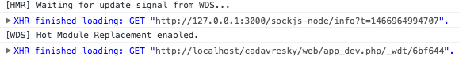

## L'application côté front

React fonctionne par composant. C'est-à-dire que des fichiers js vont inclure d'autres fichiers js et leur passer des objets.

Le composant de base s'appellera "app". Et sera rattaché au DOM par la balise "app" définie dans index.html.twig.

Créons donc ce premier composant dans app/Resources/js/app/js :

```js
import React from 'react';
import ReactDom from 'react-dom';
import Component from './component.js';

ReactDom.render(<Component/>, document.getElementById('app'));
```

Félicitations, votre application React est créée. Qu'a-t-on fait ? On a dit d'importer react, c'est le minimum. Puis react-dom, qui permettra de manipuler le DOM pour afficher nos composants. Enfin, on importe un composant nommé Component. Ce composant s'affichera dans la balise "app" du fichier HTML grâce à la fonction render de react-dom.

Bon si on regarde maintenant dans un navigateur l'adresse [http://localhost/nom_du_projet/web/app_dev.php](http://localhost/nom_du_projet/web/app_dev.php), on ne verra qu'une page blanche.

Mais en ouvrant la console du navigateur, vous devriez voir des informations de ce style :



Ceci montre que l'application React a démarré, même si elle n'affiche rien pour l'instant. Il y a d'ailleurs aussi une ligne en rouge dans cette console, à propos du composant Component. C'est normal, il n'est pas encore créé.

Pour commencer à afficher quelque chose, il faut créer le fichier component.js \(toujours dans app/Resources/js/app/\) avec ce contenu par exemple :

```js
import React from 'react';

const Component = React.createClass({
    render: function () {
        return (
            <h1>Hello world !</h1>
        );
    }
});

export default Component;
```

Ici, on déclare un composant qui s'appelle Component et qui est une classe React. Dans cette classe, la méthode render, lorsqu'elle est appelée, affiche la phrase "Hello World !". Rien de complexe donc.

Si on retourne sur notre navigateur, et qu'on rafraîchit, on doit voir apparaître cette phrase. Les prochaines modifications se verront sans avoir besoin de rafraîchir grâce au module Hot Reload de React installé au début. Mais après une erreur console, la page ne se rafraîchit pas.

Voilà, c'est tout pour cette partie. Dans une seconde partie, on va styliser un peu tout ça avec Twitter Bootstrap et voir des concepts plus avancés de React.

