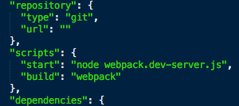

## Installation

On commence par télécharger [l'installateur Symfony tel qu'expliqué ici](http://symfony.com/doc/current/book/installation.html) :

```
--- Linux/Mac ---
sudo curl -LsS https://symfony.com/installer -o /usr/local/bin/symfony
sudo chmod a+x /usr/local/bin/symfony
```

```
--- Windows ---
c:\> php -r "readfile('https://symfony.com/installer');" > symfony
c:\> move symfony c:\projects
c:\projects\> php symfony
```

Puis on installe l'application Symfony.

```
--- Linux/Mac ---
symfony new nouveau_projet lts
```

```
--- Windows ---
c:\> cd projects/
c:\projects\> php symfony new nouveau_projet
```

Avec cette commande, ce sera la version LTS \(long term support\) actuelle qui sera installée, ce qui garantit d'avoir un support durable. Mais on peut tout aussi bien choisir une version spécifique. Par exemple :

```
symfony new nouveau_projet 3.0.2
```

Pour ceux qui avaient l'habitude d'installer Symfony avec Composer, vous pouvez constater la rapidité accrue de téléchargement et d'installation.

On peut maintenant passer à l'étape suivante : l'installation des outils du front. J'ai nommé React, Babel et Webpack.

Dans le répertoire du projet, on initialise le fichier de configuration NPM qui servira à télécharger les packages nécessaires au projet :

```
npm init -f
```

Cela crée un fichier package.json quasiment vide. J'ai ajouté l'option "-f" pour ne pas avoir à répondre aux questions posées par NPM à l'initialisation.

On ajoute les packages du projet. Deux bonnes grosses lignes de commande pour ça :

```
npm i react react-dom --save
npm i react-bootstrap react-hot-loader babel-core babel-loader babel-preset-es2015 babel-preset-react bootstrap-sass css-loader extract-text-webpack-plugin file-loader node-sass sass-loader style-loader webpack webpack-dev-server --save-dev
```

Qu'est-ce que c'est que tous ces paquets ? De base, on aurait pu se contenter des packets babel et webpack mais les paquets concernant Sass et les loaders sont là pour intégrer Twitter Bootstrap que j'ai ajouté dans le projet.

En tout cas, ces commandes vont compléter le fichier package.json déjà créé. On va aussi ajouter un élément pour les scripts :



L'élément script est vide. Ajoutez le code tel que sur la capture d'écran ci-dessus :

```js
"scripts": {
    "start": "node webpack.dev-server.js",
    "build": "webpack"
 },
```
On crée un fichier de configuration pour Babel, l'outil de transformation de ES6 en ES5 (transpileur):

```js
{
 "presets": ["react","es2015"],
 "plugins": ["react-hot-loader/babel"]
}
```

Puis, il faut un fichier de configuration webpack.config.js à la racine du projet avec ce contenu :


```js
var path = require('path');
var webpack = require('webpack');
var node_modules_dir = path.join(__dirname, 'node_modules');
var ExtractTextPlugin = require('extract-text-webpack-plugin');

var config = {
    entry: [
        'webpack-dev-server/client?http://127.0.0.1:3000',
        'webpack/hot/only-dev-server',
        './app/Resources/js/app.js',
        './app/Resources/scss/style.scss'
    ],
    output: {
        path: path.join(__dirname, 'web/dist'),
        filename: 'bundle.js',
        publicPath: 'http://127.0.0.1:3000/static/'
    },
    plugins: [
        new webpack.HotModuleReplacementPlugin(),
        new webpack.NoErrorsPlugin(),
        new ExtractTextPlugin('style.css', { allChunks: true }),
    ],
    module: {
        loaders: [
            {
                test: /\.jsx?$/,
                include: path.join(__dirname, 'app/Resources/js'),
                exclude: node_modules_dir,
                loaders: ['babel?presets[]=es2015&presets[]=react']
            },
            {
                test: /\.scss$/,
                loader: ExtractTextPlugin.extract('css!sass')
            },
            {
                test: /\.jpe?g$|\.gif$|\.png$|\.svg$|\.woff$|\.woff2?$|\.ttf$|\.eot$|\.svg$/,
                loader: "file?name=[name].[ext]"
            }
        ]
    }
};
module.exports = config;
```

Et enfin, un fichier webpack.dev-server.js :

```js
var webpack = require('webpack');
var WebpackDevServer = require('webpack-dev-server');
var config = require('./webpack.config');

new WebpackDevServer(
    webpack(config),
    {
        publicPath: config.output.publicPath,
        hot: true,
        quiet: false,
        noInfo: false,
        historyApiFallback: true
    }
).listen(
    3000,
    '0.0.0.0',
    function (err, result) {
        if (err) { console.log(err); }
        console.log('Listening at 0.0.0.0:3000');
    }
);
```

Etant donné que le fichier de configuration \(webpack.config.js\) mentionne app.js et style.scss dans "entry", créons deux fichiers vides qui seront utilisés par le serveur webpack et que nous allons remplir plus tard :

* dans app/Resources/js, le fichier app.js
* dans app/Resources/scss, le fichier style.scss

Tout est prêt pour commencer à coder : un serveur Node webpack.dev-server \(basé sur Express en fait\) écoute les modifications sur le code, construit et sert le fichier bundle.js selon la configuration définie dans le fichier webpack.config.js.

Il reste donc à démarrer le serveur Symfony, en ligne de commande, à la racine du projet :

```
php app/console server:run
```

et la tâche \(dans un deuxième terminal\) qui sera utilisée pour le développement :

```
npm start
```

Cette commande lance, selon le fichier package.json, une commande Node qui démarre le serveur de développement de webpack. Aucun fichier n'est créé, il est en mémoire du serveur webpack et servi tel quel. Inutile donc de chercher le fichier bundle.js défini dans le "output" du fichier webpack.config.js. En revanche, on peut avoir un aperçu du fichier généré en se rendant à l'adresse [http://127.0.0.1:3000/static/bundle.js](http://127.0.0.1:3000/static/bundle.js). Ce fichier sera mis à jour à chaque changement dans les fichiers js que nous créerons dans la sous-partie "L'application côté front".

Pour la production, il suffira de lancer la commande

```
npm build
```

qui lancera webpack en mode production, c'est-à-dire qui créera un fichier js minifié, utilisable sans avoir à démarrer le serveur webpack donc.

Pour l'instant, nous sommes en phase de développement, on se contente donc de "npm start". Vous devez obtenir le message suivant dans votre terminal :

```
webpack: bundle is now VALID.
```

Si c'est bien le cas, on va créer l'application React. Elle sera incorporée à l'application Symfony. On va donc commencer par mettre en place les conditions pour que React puisse s'épanouir dans l'environnement qui l'accueillera.

